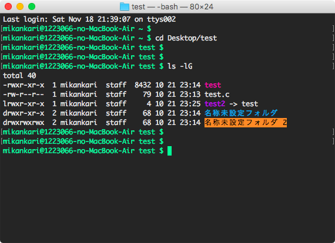
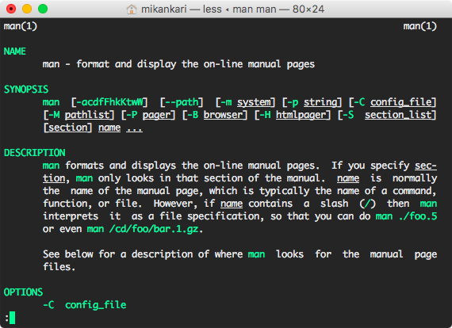
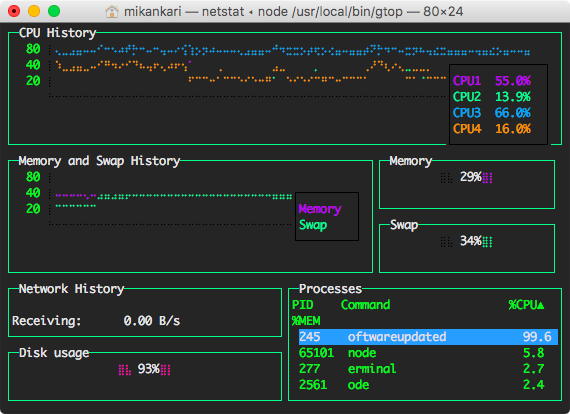
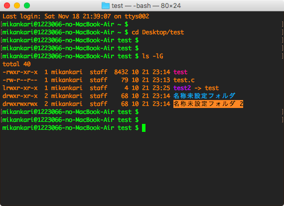
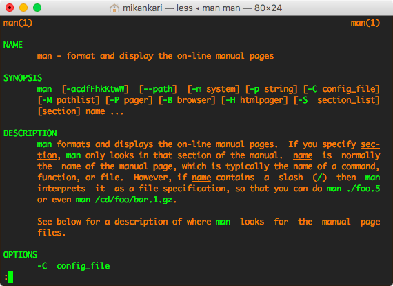
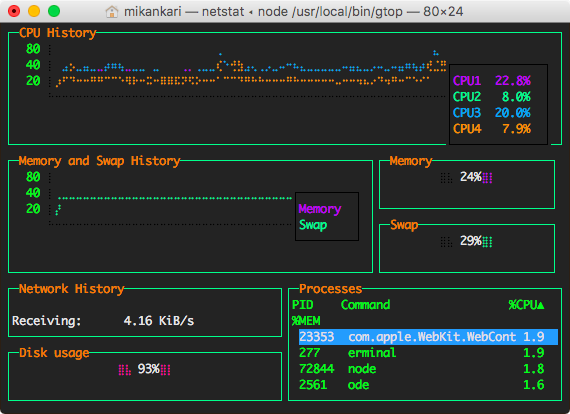

# Terminal.app Profiles

Profiles for Terminal.app in macOS which set themed colors

Themes
- Cool
- Warm

In the screenshots, it has settled the following variable in .bash_profile

```
PS1="\[\e[0;1m\]\u@\h \W $ \[\e[0m\]"
```

## Cool screenshots

Shell



Man page



[Graphical Top](https://www.npmjs.com/package/gtop)




## Warm screenshots

Shell



Man page



[Graphical Top](https://www.npmjs.com/package/gtop)




